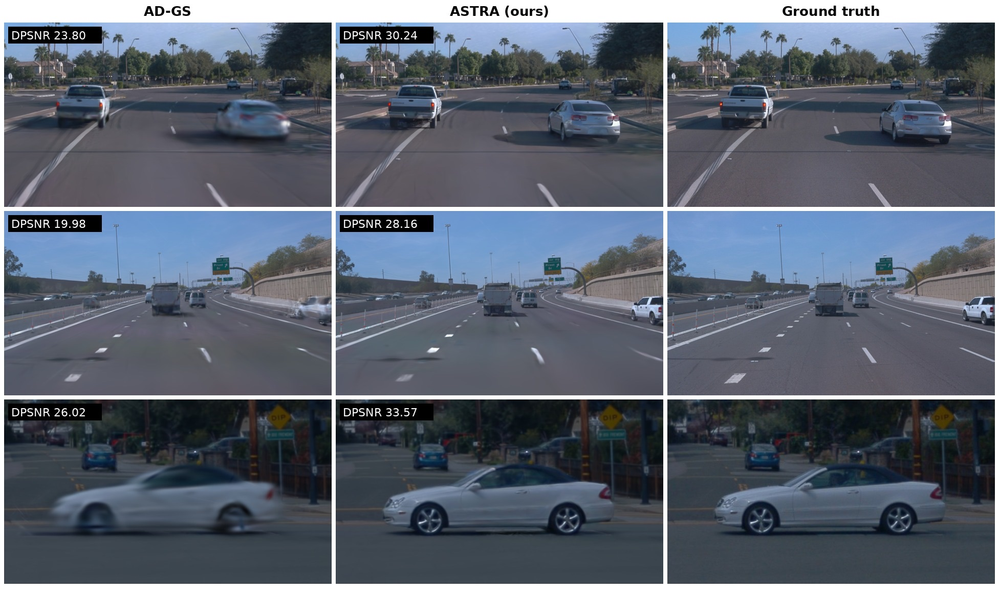
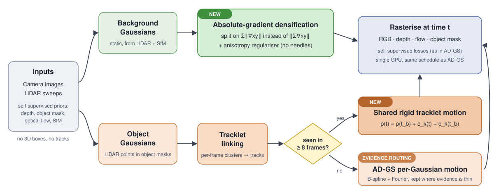

<h1 align="center">ASTRA</h1>

<p align="center">
  <b>Rigid tracklet motion and absolute-gradient densification<br>for self-supervised dynamic driving-scene Gaussian splatting</b>
</p>

<p align="center">
  <a href="https://github.com/JiaweiXu8/AD-GS">
    
  </a>
  
  <a href="https://drive.google.com/drive/folders/1u3J7nNgE8fgm7e0QFZu-azJ7GIaBzrJ8">
    
  </a>
  
</p>

<p align="center">
  <br>
  <em>Held-out Waymo test views. AD-GS blurs and smears moving vehicles; ASTRA keeps them sharp.
  Numbers are the dynamic-region PSNR of that image.</em>
</p>

## 📜 News

🔥 **[2026/09]** Code, benchmark scripts, preprocessed KITTI-MOT / nuScenes data and the
ground-truth DPSNR evaluation are released.

## ✒️ Contents

- [Overview](#-overview)
- [Results](#-results)
- [Installation](#%EF%B8%8F-installation)
- [Data](#-data)
- [Training and evaluation](#-training-and-evaluation)
- [Reproducing the paper tables](#-reproducing-the-paper-tables)
- [Repository layout](#%EF%B8%8F-repository-layout)
- [License](#-license)
- [Citation](#-citation)
- [Acknowledgment](#-acknowledgment)

## 👀 Overview

Self-supervised driving-scene reconstruction has to separate moving objects from the static
world without 3D boxes or tracks. [AD-GS](https://github.com/JiaweiXu8/AD-GS) does this with a
static background and object Gaussians that each follow their **own** B-spline + Fourier
trajectory. Two things limit it:

- **Objects.** Nothing ties the Gaussians of one car together, so every Gaussian must explain
  the car's motion on its own. Between training frames the car falls apart into a blurred
  smear (see the figure above).
- **Background.** The 3DGS densification criterion sums signed screen-space gradients before
  taking the norm, so opposing gradients cancel and under-reconstructed regions are never split.

ASTRA keeps AD-GS unchanged and adds three components, all trained end to end on a single GPU
with the same self-supervision (no boxes, no tracks, no teacher):

1. **Shared rigid tracklet motion.** Object LiDAR points are linked across frames into
   tracklets. Every Gaussian on a tracklet moves with one shared trajectory:
   `p(t) = p(t_b) + c_k(t) - c_k(t_b)`, where `t_b` is the frame the Gaussian was born in.
2. **Evidence routing.** Only tracklets observed in at least 8 frames get the shared trajectory.
   Gaussians without that evidence keep the AD-GS per-Gaussian motion instead of being forced
   into a model the data cannot support.
3. **Absolute-gradient densification.** Background splitting uses `Σ‖∇xy‖` (a custom CUDA
   rasterizer) plus an anisotropy regulariser that suppresses needle-shaped Gaussians.

<p align="center">
  
</p>

## 📊 Results

Apart from the "reported" row, every number comes from the scripts in this repository (one run per
scene). "AD-GS (reproduced)" is the official AD-GS code trained with exactly the same schedule on
the same machine.

### Waymo (8 scenes, front camera, nvs-75, 30k iterations)

DPSNR is PSNR on ground-truth **moving**-object masks (3D boxes with speed ≥ 1 m/s, projected
into the image), averaged over test images — the protocol used by StreetGS, AD-GS and IDSplat.
Ground truth is used only for evaluation.

| Method | PSNR ↑ | SSIM ↑ | LPIPS ↓ | DPSNR ↑ |
|---|:---:|:---:|:---:|:---:|
| AD-GS (reported) | 33.91 | 0.927 | **0.228** | 27.41 |
| AD-GS (reproduced) | 33.61 | 0.926 | 0.244 | 26.61 |
| **ASTRA (ours)** | **34.09** | **0.930** | 0.230 | **28.44** |

ASTRA improves on AD-GS on **all 8 scenes** in PSNR and DPSNR (+0.48 PSNR, +1.83 DPSNR on average).

<details>
<summary>Per-scene results</summary>

| Scene | PSNR AD-GS | PSNR ASTRA | DPSNR AD-GS | DPSNR ASTRA |
|---|:---:|:---:|:---:|:---:|
| 006 | 34.67 | **34.90** | 30.21 | **31.12** |
| 026 | 30.92 | **31.22** | 23.94 | **27.41** |
| 090 | 30.65 | **30.87** | 25.76 | **26.60** |
| 105 | 35.55 | **36.22** | 25.96 | **28.06** |
| 108 | 36.19 | **36.61** | 27.22 | **29.17** |
| 134 | 33.38 | **33.82** | 25.71 | **26.69** |
| 150 | 29.70 | **30.77** | 23.13 | **26.11** |
| 181 | 37.78 | **38.29** | 30.95 | **32.34** |
| **Mean** | 33.61 | **34.09** | 26.61 | **28.44** |

</details>

### KITTI-MOT (sequences 0001 / 0002 / 0006, stereo, 60k iterations)

Each split is averaged over the three sequences, as in AD-GS.

| Split | Method | PSNR ↑ | SSIM ↑ | LPIPS-VGG ↓ | LPIPS-Alex ↓ |
|---|---|:---:|:---:|:---:|:---:|
| 75% | AD-GS (reproduced) | 29.17 | 0.921 | 0.083 | 0.033 |
|     | **ASTRA** | **29.25** | **0.926** | **0.073** | **0.029** |
| 50% | AD-GS (reproduced) | 28.47 | 0.912 | 0.088 | 0.036 |
|     | **ASTRA** | **28.98** | **0.921** | **0.074** | **0.030** |
| 25% | AD-GS (reproduced) | 24.14 | 0.868 | 0.121 | **0.065** |
|     | **ASTRA** | **24.16** | **0.869** | **0.117** | **0.065** |

### nuScenes (6 scenes, three front cameras, 60k iterations)

| Method | PSNR ↑ | SSIM ↑ | LPIPS-VGG ↓ | LPIPS-Alex ↓ |
|---|:---:|:---:|:---:|:---:|
| AD-GS (reproduced) | **31.20** | **0.928** | 0.164 | 0.079 |
| **ASTRA** | 31.19 | 0.927 | **0.159** | **0.073** |

Pixel fidelity is on par with AD-GS while perceptual quality (LPIPS) improves on **all 6 scenes**.

<details>
<summary>Per-scene results</summary>

| Scene | PSNR AD-GS | PSNR ASTRA | LPIPS-VGG AD-GS | LPIPS-VGG ASTRA |
|---|:---:|:---:|:---:|:---:|
| 0230 | 29.95 | **29.99** | 0.211 | **0.207** |
| 0242 | 30.27 | **30.43** | 0.193 | **0.181** |
| 0255 | **32.84** | 32.70 | 0.143 | **0.140** |
| 0295 | 29.32 | **29.46** | 0.119 | **0.113** |
| 0518 | **30.54** | 30.41 | 0.186 | **0.183** |
| 0749 | **34.25** | 34.14 | 0.131 | **0.127** |

</details>

## 🛠️ Installation

Tested on Ubuntu 22.04, CUDA 11.8, one NVIDIA A40 (any GPU with ≥ 24 GB works).

**1. Clone**

```bash
git clone https://github.com/ChizkiyahuOhayon/ASTRA.git
cd ASTRA
```

**2. Environment** (same as AD-GS, plus one extra CUDA extension)

```bash
conda env create -f environment.yaml
conda activate AD-GS
pip install setuptools==69.5.1 roma==1.5.1   # see the notes below
pip install "git+https://github.com/facebookresearch/pytorch3d.git"
```

**3. CUDA extensions.** Set `TORCH_CUDA_ARCH_LIST` to your GPU first
(`8.6` A40 / RTX 3090, `8.9` RTX 4090, `9.0` H100).

```bash
export TORCH_CUDA_ARCH_LIST=8.6
pip install -e ./submodules/simple-knn
pip install -e ./submodules/depth-diff-gaussian-rasterization
pip install -e ./submodules/abs-diff-gaussian-rasterization   # ASTRA: absolute-gradient rasterizer
```

**4. Check**

```bash
python -m unittest tests.test_shared_motion tests.test_adgs_residual
```

<details>
<summary>Why these pins</summary>

- `setuptools>=70` removes `pkg_resources.packaging`, which every CUDA extension build for
  torch < 2.5 imports.
- An unpinned `roma` pulls a `+cu121` torch build that no longer matches a CUDA 11.8 `nvcc`.
- Building `pytorch3d` from source (the command above) takes about 20 minutes; a prebuilt wheel
  must match torch / CUDA / Python exactly (`py38_cu118_pyt201` for these pins).

</details>

## 📦 Data

All scripts expect this layout:

```
data/
├── waymo/                 scene006 … scene181   (preprocess yourself, see below)
├── waymo_dynamic_masks/   ground-truth moving-object masks for DPSNR
├── kitti/                 0001  0002  0006
└── nuscenes/              scene-0230 … scene-0749
```

### Option A — download the preprocessed data (KITTI-MOT and nuScenes)

We host KITTI-MOT and nuScenes **with all priors already computed** (depth, object and sky
masks, optical flow, LiDAR and SfM point clouds) on
**[Google Drive](https://drive.google.com/drive/folders/1u3J7nNgE8fgm7e0QFZu-azJ7GIaBzrJ8)** (~7.5 GB compressed).

```bash
pip install gdown
bash scripts/download_data.sh          # downloads, verifies checksums, unpacks into data/
```

Every scene is a `.tar.gz` split into ≤ 1 GB parts; the script joins them with
`cat <scene>.tar.gz.part-* | tar xz`.

### Option B — preprocess from the raw datasets

Required for **Waymo**, whose license does not allow redistributing processed data. The
pipeline is AD-GS's: extract frames and LiDAR, then compute five self-supervised priors.

<details>
<summary><b>One-time tool setup</b> (Depth-Anything-V2, Grounded-SAM-2, CoTracker3, COLMAP)</summary>

```bash
# Monocular depth: Depth-Anything-V2-Large
git clone https://github.com/DepthAnything/Depth-Anything-V2
cp scripts/run-dpt.py Depth-Anything-V2/
conda create -n dpt python=3.11 -y && conda activate dpt
pip install -r Depth-Anything-V2/requirements.txt
mkdir -p Depth-Anything-V2/checkpoints
wget -O Depth-Anything-V2/checkpoints/depth_anything_v2_vitl.pth \
    "https://huggingface.co/depth-anything/Depth-Anything-V2-Large/resolve/main/depth_anything_v2_vitl.pth?download=true"

# Object and sky masks: Grounded-SAM-2 (needs Python >= 3.10)
git clone https://github.com/IDEA-Research/Grounded-SAM-2.git
cp scripts/semantic.py Grounded-SAM-2/
conda create -n sam python=3.10 -y && conda activate sam
cd Grounded-SAM-2 && pip install torch torchvision && pip install -e . \
    && pip install --no-build-isolation -e grounding_dino
(cd checkpoints && bash download_ckpts.sh) && (cd gdino_checkpoints && bash download_ckpts.sh) && cd ..

# Optical flow: CoTracker3 is loaded through torch.hub by scripts/flow.py (AD-GS env)
# SfM points: COLMAP, e.g. conda install colmap=3.7 -c conda-forge
conda activate AD-GS
```

Two known pitfalls: add `".png"` and `".PNG"` to the image extensions in
`Grounded-SAM-2/sam2/utils/misc.py` if it rejects PNG frames, and run `scripts/flow.py` with
`numpy<1.24` (newer versions refuse the ragged arrays it saves).

</details>

<details>
<summary><b>Waymo</b></summary>

1. Register at [waymo.com/open](https://waymo.com/open) and download these eight **v1.4.1**
   validation segments (the StreetGS selection) into one folder:

   | scene | segment | scene | segment |
   |---|---|---|---|
   | 006 | `10448102132863604198_472_000_492_000` | 108 | `2094681306939952000_2972_300_2992_300` |
   | 026 | `12374656037744638388_1412_711_1432_711` | 134 | `4246537812751004276_1560_000_1580_000` |
   | 090 | `17612470202990834368_2800_000_2820_000` | 150 | `5372281728627437618_2005_000_2025_000` |
   | 105 | `1906113358876584689_1359_560_1379_560` | 181 | `8398516118967750070_3958_000_3978_000` |

   Files are named `individual_files_validation_segment-<segment>_with_camera_labels.tfrecord`.

2. Extract frames and LiDAR:

   ```bash
   pip install tensorflow==2.11.0
   pip install waymo-open-dataset-tf-2-11-0==1.6.1 --no-dependencies
   bash scripts/waymo/prepare-waymo.sh <waymo_folder>
   ```

3. Depth and masks, once per scene:

   ```bash
   SCENES="scene006 scene026 scene090 scene105 scene108 scene134 scene150 scene181"
   conda activate dpt && cd Depth-Anything-V2
   for s in $SCENES; do python run-dpt.py --img-path ../data/waymo/$s/image --outdir ../data/waymo/$s/depth; done
   conda activate sam && cd ../Grounded-SAM-2
   for s in $SCENES; do
       python semantic.py ../data/waymo/$s --text sky. --name sky
       python semantic.py ../data/waymo/$s --text car.bus.truck.van.human. --name semantic
   done
   cd .. && conda activate AD-GS
   ```

4. The remaining stages loop over all scenes themselves. Keep this order; COLMAP reads the masks:

   ```bash
   bash scripts/waymo/segment-pcd.sh      # split LiDAR into object / background points
   bash scripts/waymo/prepare-flow.sh     # CoTracker3 optical flow
   bash scripts/waymo/prepare-colmap.sh   # SfM background points
   ```

5. Ground-truth moving-object masks for DPSNR (evaluation only):

   ```bash
   python scripts/eval/waymo_dynamic_masks.py --raw_dir <waymo_folder> --out data/waymo_dynamic_masks
   ```

</details>

<details>
<summary><b>KITTI-MOT</b></summary>

Download the tracking benchmark (left and right images, GPS/IMU, calibration, Velodyne) from
[cvlibs.net](https://www.cvlibs.net/datasets/kitti/eval_tracking.php), then run
`bash scripts/kitti/prepare-kitti.sh <kitti_folder>` and the same prior stages as for Waymo
with `data/kitti/<0001|0002|0006>` and the `scripts/kitti/*.sh` helpers.

The official archive of sequence 0001 lacks LiDAR frames 177–180. AD-GS pairs images and LiDAR
by position; we keep that behaviour so the numbers stay comparable with AD-GS.

</details>

<details>
<summary><b>nuScenes</b></summary>

Download v1.0-trainval (the three front cameras, `LIDAR_TOP` and `maps/` are enough), then run
`bash scripts/nuscene/prepare-nuscenes.sh <nuscenes_folder>` and the same prior stages with
`data/nuscenes/<scene>` and the `scripts/nuscene/*.sh` helpers.

Scenes 0242, 0295 and 0749 have a stationary ego vehicle in the official data; this is
expected, not an extraction error.

</details>

## 🚀 Training and evaluation

ASTRA is AD-GS's `train.py` / `render.py` with a few extra flags and one environment variable
that selects the absolute-gradient rasterizer.

**Waymo** (30k iterations)

```bash
ADGS_RASTERIZER=abs python train.py -c arguments/waymo.py -s data/waymo/scene026 -m output/scene026 \
    --iterations 30000 --save_iterations 30000 --test_iterations 30000 \
    --shared_motion --shared_motion_support_gate --shared_motion_basis_cache \
    --abs_grad --densify_scene_grad_threshold 0.00072 --densify_obj_grad_threshold 0.00072 --lambda_aniso 0.003
```

**KITTI-MOT and nuScenes** (60k iterations, with evidence routing)

```bash
ADGS_RASTERIZER=abs python train.py -c arguments/kitti-75.py -s data/kitti/0006 -m output/0006-nvs75 \
    --split_mode nvs-75 --iterations 60000 --save_iterations 60000 --test_iterations 60000 \
    --shared_motion --shared_motion_support_gate --shared_motion_basis_cache --shared_motion_adgs_ungated \
    --abs_grad --densify_scene_grad_threshold 0.00072 --densify_obj_grad_threshold 0.00072 --lambda_aniso 0.003
# nuScenes: -c arguments/nuscenes.py -s data/nuscenes/<scene>, no --split_mode
```

**Render and evaluate**

```bash
ADGS_RASTERIZER=abs python render.py -c arguments/waymo.py -m output/scene026 --iteration 30000 --skip_train
# -> output/scene026/results.json (PSNR, SSIM, LPIPS-VGG, LPIPS-Alex, FPS)

python scripts/eval/dynamic_psnr.py -m output/scene026 -s data/waymo/scene026 --iteration 30000
# -> output/scene026/results-dpsnr.json (Waymo only)
```

| Flag | Component |
|---|---|
| `--shared_motion --shared_motion_support_gate` | shared rigid motion for tracklets seen in ≥ 8 frames |
| `--shared_motion_adgs_ungated` | evidence routing: unsupported Gaussians keep AD-GS motion |
| `--shared_motion_basis_cache` | caches the spline basis (speed only, identical output) |
| `ADGS_RASTERIZER=abs --abs_grad` + thresholds | absolute-gradient densification |
| `--lambda_aniso 0.003` | anisotropy regulariser |

Dropping all of them (and `ADGS_RASTERIZER`) gives the original AD-GS.

## 🔁 Reproducing the paper tables

One command per dataset trains every scene, renders the test split, evaluates it and prints
the table. Finished scenes are skipped, so a script can be stopped and restarted.

```bash
bash scripts/benchmark/waymo.sh        # 8 scenes  → output/waymo/astra
bash scripts/benchmark/kitti.sh        # 9 runs    → output/kitti/astra
bash scripts/benchmark/nuscenes.sh     # 6 scenes  → output/nuscenes/astra

# the AD-GS rows: same scripts, same schedule, method switched off
METHOD=adgs bash scripts/benchmark/waymo.sh

# print any table again
python scripts/benchmark/summarize.py output/waymo/astra
```

Budget roughly 2–3 GPU-hours per Waymo scene and 3–5 per KITTI / nuScenes run on one A40.

## 🗂️ Repository layout

```
arguments/                       per-dataset configs (waymo, kitti-25/50/75, nuscenes)
scene/gaussian_model.py          object / background Gaussians, evidence routing
utils/shared_motion.py           tracklet linking, support gate, shared rigid motion
submodules/abs-diff-gaussian-rasterization/   rasterizer that accumulates Σ‖∇xy‖
scripts/benchmark/               one-command reproduction of every table
scripts/eval/                    Waymo moving-object masks and DPSNR
scripts/{waymo,kitti,nuscene}/   data preparation (from AD-GS)
scripts/probe/                   analysis tools (error attribution, instance linking)
tests/                           unit tests for the motion model
```

## 📄 License

Code we added is released under the [Apache 2.0 license](LICENSE). Code inherited from
[AD-GS](https://github.com/JiaweiXu8/AD-GS) follows the terms of that repository.

The hosted data are derived from [KITTI](https://www.cvlibs.net/datasets/kitti/)
(CC BY-NC-SA 3.0) and [nuScenes](https://www.nuscenes.org/terms-of-use) (CC BY-NC-SA 4.0) and
keep those non-commercial licenses; please also cite the original datasets. Waymo data is not
redistributed; use it under the [Waymo Open Dataset terms](https://waymo.com/open/terms/).

## 📚 Citation

The ASTRA paper is in preparation. Until then, please cite AD-GS, on which this code is built:

```bibtex
@inproceedings{xu2025adgs,
  title     = {AD-GS: Object-Aware B-Spline Gaussian Splatting for Self-Supervised Autonomous Driving},
  author    = {Xu, Jiawei and others},
  booktitle = {International Conference on Computer Vision (ICCV)},
  year      = {2025}
}
```

## 🙏 Acknowledgment

ASTRA is built on [AD-GS](https://github.com/JiaweiXu8/AD-GS) and
[3D Gaussian Splatting](https://github.com/graphdeco-inria/gaussian-splatting). The moving-object
evaluation follows [StreetGaussians](https://github.com/zju3dv/street_gaussians) and
[EmerNeRF](https://github.com/NVlabs/EmerNeRF). We thank the authors of
[Depth-Anything-V2](https://github.com/DepthAnything/Depth-Anything-V2),
[Grounded-SAM-2](https://github.com/IDEA-Research/Grounded-SAM-2),
[CoTracker](https://github.com/facebookresearch/co-tracker) and
[COLMAP](https://colmap.github.io/) for the tools used to build the priors.
